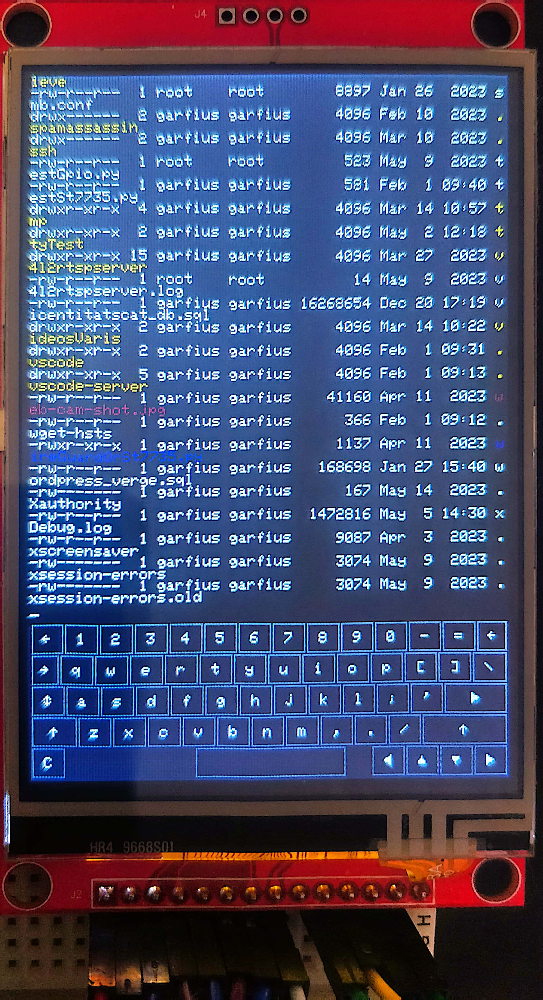
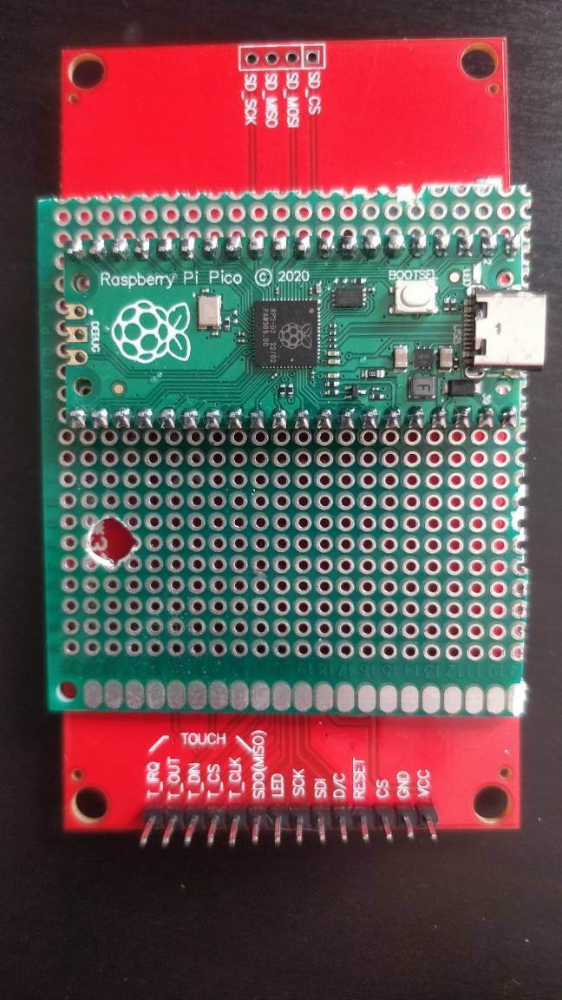

# TinTTY

Tiny console terminal implemented in Arduino C and c++.

Uses EEPROM to save calibaration data, to re-calibrate, keep touching screen while booting.

Uses frameBuffer sprite and circular buffer to process input and output data, refreshes when idle, see snappyMillisLimit.

Tested at 57600 baud ok.



## Prerequisites

- TFT_eSPI <--User_Setup.h--> move to the lib. folder, overWrite
- Raspberry pi pico(rp2040) and ili9488
- Compiled using https://github.com/earlephilhower/platform-raspberrypi on platformio on vscode.

## Optional configurations

- Choose Serial console Stream device at setup() -> userTty (see tintty_main.ino)
- Choose refresh idle time at snappyMillisLimit
- Choose circular buffer sizes at charBuffer.h
- Colors are pretty much made up, change at tintty.h -> myPalette

### pins for ILI9488:

WARNING - Pin 6 used at input.h errorLed to be used at giveErrorVisibility at input.cpp, to get phisical error feedback.

- T_IRQ => GP_8
- T_OUT == TFT_MISO => GP_16
- T_DIN == SDI == TFT_MOSI => GP_19
- T_CS => GP_7
- T_CLK == SCK == TFT_SCLK => GP_18
- SDO_MISO => 
- LED => 3.3V || 5V
- SCK == T_CLK == TFT_SCLK => GP_18
- SDI == T_DIN == TFT_MOSI => GP_19
- D/C => GP_2
- RESET == TFT_RST => GP_3



### TO DO

- Buffered scrolling
- Test on the original ILI9341
- Scroll back
- Improve speed, must go up to 115200
- enable cursor

## Development

Testing on Windows is easy to do from a Vagrant VM running Linux. Arduino usually exposes the USB connection as serial COM3 port, so the VM is configured to forward the COM3 port to `/dev/ttyS0` inside the Linux environment.

First, ensure the sketch is uploaded (Vagrant will block further COM3 usage when the VM starts).

Start the VM and log in.

```
vagrant up
vagrant ssh
```

Inside the Linux VM, the `/dev/ttyS0` serial port will now be accessible to talk to the Arduino board. The default baud rate is 9600, which matches the test sketch serial settings.

Simple echo will not work as expected because the Uno board resets once a new connection starts. Instead, the simplest test is to use GNU Screen.

```
sudo screen /dev/ttyS0
```

Keystrokes will be sent immediately to the sketch. Screen is technically itself a serial terminal, not a host, so certain keys will not behave as expected. But simple letters should produce visual output on the TFT screen. Exit GNU screen by pressing `Ctrl-A` and typing `:quit`.

A proper console test is to start a real shell session using Linux *getty*. The *getty* process continuously waits for terminal availability on a given port and spawns a new login shell when the device is ready for display.

Because the Arduino has to spend some time booting and setting up, the sketch emits a CR character once it boots, which lets *getty* wake up and prompt for login. We use the *getty* `--wait-cr` option to make it wait for that code.

```
sudo su -c '/sbin/getty -L --wait-cr ttyS0' &
```

Some extra notes on launching *getty*:

> The *getty* process should not interact with the shell that spawns it, so we launch it in the background. It is important that the *getty* process is detached from the current ssh session, otherwise the login shell does not get assigned the serial device as its controlling terminal. If that happens, we see a warning like `-bash: cannot set terminal process group` because two login shells now try to control the same device - the original ssh and the new *getty*-spawned one. The *su* command helps perform that detachment.

Inside the console, once logged-in, run the sizing command, since the screen is non-standard:

```
stty rows 16 columns 21
```

Then just log out from the shell. If the login did not work, to terminate *getty* from the original root shell, just do a normal `kill [pid]` command - it still responds to external SIGTERM.

## References

Existing AVR-based implementation as initial inspiration:

- https://github.com/mkschreder/avr-vt100 (and updated version https://bitbucket.org/scargill/experimental-terminal/src)

General VT100/ANSI docs:

- http://vt100.net/docs/vt100-ug/chapter3.html
- http://vt100.net/docs/vt220-rm/chapter4.html
- https://www.gnu.org/software/screen/manual/html_node/Control-Sequences.html#Control-Sequences
- https://en.wikipedia.org/wiki/ANSI_escape_code#Colors

Other interesting implementations I found:

- http://www.msarnoff.org/terminalscope/ (https://github.com/74hc595/Terminalscope)
- https://madresistor.com/diy-vt100/ (https://gitlab.com/madresistor/diy-vt100-firmware)
- http://geoffg.net/terminal.html
